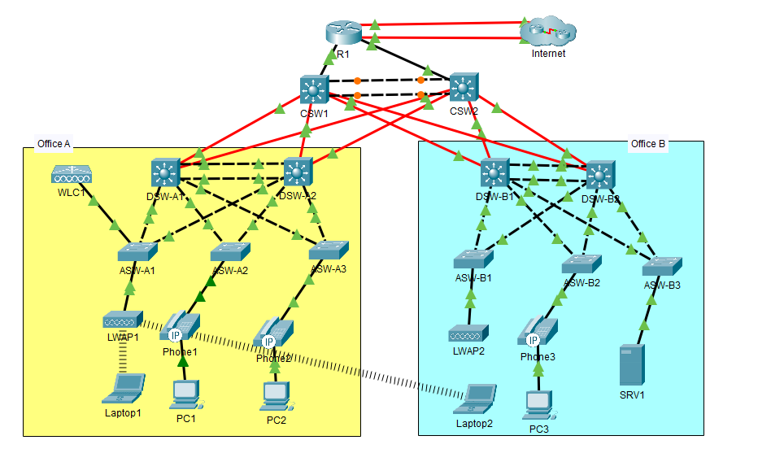

# ccna-mega-lab
A large-scale networking lab based on Jeremy’s IT Lab CCNA Mega Lab, covering routing, switching, network services, security, and troubleshooting using Cisco Packet Tracer.

## Project Overview

The lab combines multiple networking technologies into a single enterprise-style topology connecting two sites, **Office A** and **Office B**. The network includes a redundant Layer 3 core, distribution and access layers, an edge router, and dual WAN connections.

The goal of the lab was to bring together the concepts covered throughout the CCNA course and practice configuring, verifying, and troubleshooting them in an integrated network environment.
## Network Topology 


## Key Technical Features

* **Layer 2:** VLANs, trunking, VTPv2, L2 EtherChannel (PAgP/LACP), Rapid PVST+, root bridge configuration, PortFast, and BPDU Guard.
* **Layer 3 & Redundancy:** Layer 3 EtherChannel, HSRPv2, OSPFv2, DR/BDR configuration, IPv6 static routing, and EUI-64.
* **Network Services:** DHCP, DHCP relay, Dynamic PAT, Static NAT, NTP, Syslog, SNMPv2c, and SSHv2.
* **Security:** DHCP Snooping, Dynamic ARP Inspection (DAI), Port Security, and standard/extended ACLs.
* **Wireless:** Cisco WLC configuration, WPA2 authentication, dynamic VLAN assignment, and AP association.

## Troubleshooting Example

During the lab, an HSRP issue occurred because the two distribution switches were running different HSRP versions.

One router was configured for HSRP version 1 while the other was configured for HSRP version 2. This resulted in HSRP-related errors and prevented the expected redundancy behavior.

The issue was identified using:

```text
show standby
```
The output revealed the HSRP version mismatch between the two switches. After configuring both switches to use HSRP version 2, the HSRP active/standby relationship was established successfully.

